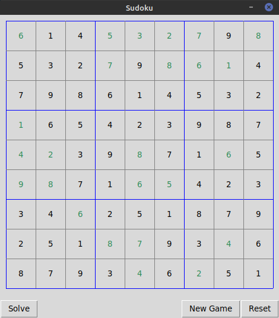

# Sudoku Solver
A GUI game that randomly generates and solves Sudoku puzzles using backtracking

## Getting Started
These instructions will get you a copy of the project up and running on your local machine.

The software can be started from the root of the repository:
```
python3 sudokusolver/sudokusolver.py
```

A game like this should appear:


The games are created randomly

The random Sudoku puzzle can be solved at any time (even after entering some numbers of your own) by pressing the "Solve" button (keep in mind that the solve algorithm is based on the original board; so, it may delete some of your inputs if they
are incorrect):



The puzzle can be restored to its original state by pressing the "Reset" button:


The user can try to solve the puzzle on thier own by selecting tiles and entering numbers from the keyboard:


A new game can be generated at any time by pressing the "New Game" button:


### Prerequisites
This project uses Python 3 and is not backwards compatible. It uses only Python standard libraries, but you might need to 
install the version of Python 3 that includes tkinter.

For Debian distributions:
```
sudo apt-get install python3-tk
```
For Fedora distributions:
```
sudo dnf install python3-tkinter
```
